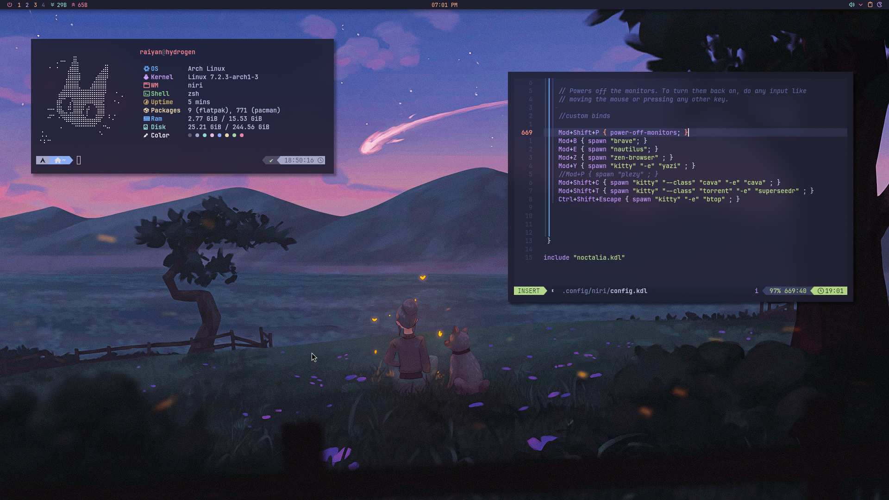

# ✦ My Dotfiles

> A collection of my personal Linux configurations — built around **Niri**, **Noctalia**, and a cozy **Catppuccin Mocha** aesthetic.

<p align="center">
  
</p>

<p align="center">
  <strong>Simple • Minimal • Cozy • Linux</strong>
</p>

---

## 🖥️ What's Inside

| Config | Description |
|--------|-------------|
| `cava` | Audio visualizer |
| `fastfetch` | System information |
| `fuzzel` | Application launcher |
| `kitty` | Terminal emulator |
| `niri` | Scrollable tiling Wayland compositor |
| `noctalia` | Desktop shell & widgets |
| `yazi` | Terminal file manager |

---

## 🎨 Theme

The setup mainly follows the **Catppuccin Mocha** color palette.

**Style:**  
`Dark` · `Minimal` · `Rounded` · `Cozy`

---

## 🚀 Installation

Clone the repository:

```bash
git clone https://github.com/ohhraiyan/dots.git
cd dots
```

Run the installer:

```bash
chmod +x install.sh
./install.sh
```

---

## 📁 Structure

```text
dots/
├── .config/
│   ├── cava/
│   ├── fastfetch/
│   ├── fuzzel/
│   ├── kitty/
│   ├── niri/
│   ├── noctalia/
│   └── yazi/
│
├── install.sh
├── screenshot.png
└── README.md
```
